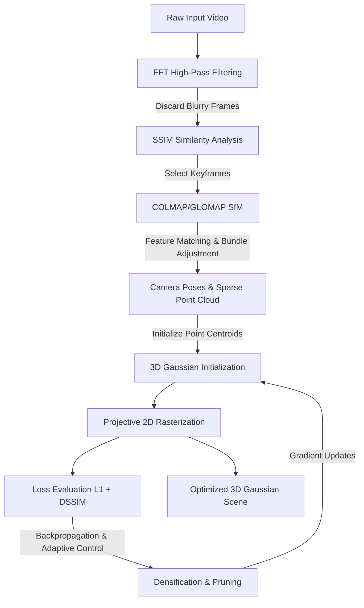
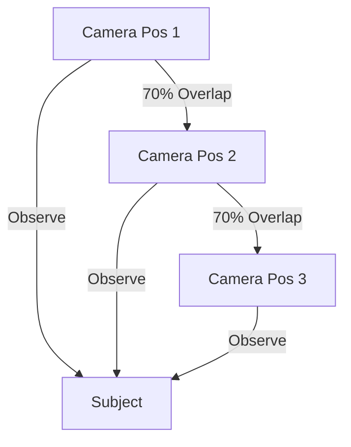
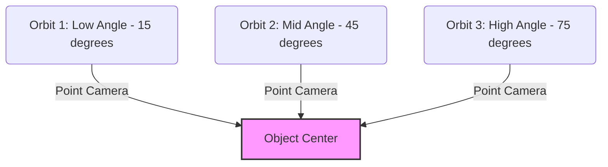
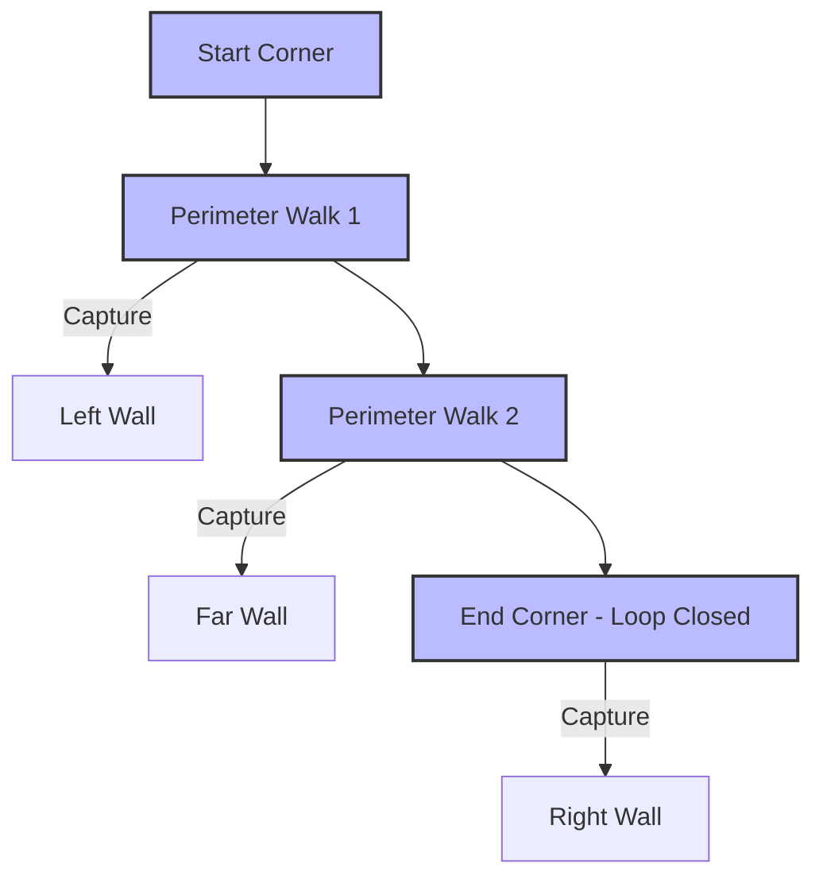

# Capture and Recording Guide for 3D Gaussian Splatting

This document provides the theoretical foundation and practical execution guidelines for acquiring video data optimized for 3D Gaussian Splatting (3DGS) reconstruction. It contains detailed camera settings, flight/movement strategies, and technical explanations of how 3DGS models are constructed.

---

## 1. Theoretical Foundations of 3D Gaussian Splatting

3D Gaussian Splatting, introduced by Kerbl et al. (2023) [1], is a real-time radiance field rendering technique that represents a 3D scene using millions of anisotropic, volumetric 3D Gaussians. 

Unlike implicit neural representations such as NeRFs (Neural Radiance Fields), which query a multi-layer perceptron (MLP) along rays, 3DGS is an explicit, rasterization-based representation. This allows it to bypass expensive ray-marching and achieve real-time rendering frame rates (exceeding 100 FPS).

### Mathematical Representation
Each 3D Gaussian in the scene is defined by four primary parameters:
1. **Position (Mean)**: A centroid $\mu \in \mathbb{R}^3$.
2. **Covariance**: A 3D covariance matrix $\Sigma \in \mathbb{R}^{3\times 3}$. To ensure $\Sigma$ remains positive semi-definite during gradient descent, it is factored into a scaling matrix $S$ (parameterized by a vector $s \in \mathbb{R}^3$) and a rotation matrix $R$ (parameterized by a normalized quaternion $q \in \mathbb{R}^4$):
   $$\Sigma = R S S^T R^T$$
3. **Opacity**: A volumetric density parameter $\alpha \in [0, 1]$.
4. **Color**: Represented using Spherical Harmonics (SH) coefficients. These coefficients allow the model to capture view-dependent effects like specular highlights and reflections.

### The Pipeline Workflow
The pipeline moves from raw video capture to the final optimized splat through the following steps:

### 2D Projection and Rasterization
To render the scene, 3D Gaussians are projected onto the 2D image plane of a camera. The 2D covariance $\Sigma'$ in camera coordinates is calculated using the Jacobian $J$ of the projective transformation and the viewing transformation matrix $W$:
$$\Sigma' = J W \Sigma W^T J^T$$
A highly parallel, tile-based differentiable rasterizer then sorts the Gaussians by depth and accumulates their contributions along each pixel using alpha blending:
$$C = \sum_{i \in N} c_i \alpha_i \prod_{j=1}^{i-1} (1 - \alpha_j)$$
where $c_i$ is the color computed from the Spherical Harmonics and $\alpha_i$ is the projected opacity.

### Loss Function & Adaptive Control
The network optimizes the Gaussian parameters by minimizing a loss function comparing the rendered image $\hat{I}$ to the target keyframe $I$:
$$\mathcal{L} = (1 - \lambda)\mathcal{L}_1 + \lambda(1 - \text{SSIM})$$
where $\lambda$ is typically set to $0.2$.

During training, **Adaptive Density Control** runs periodically:
- **Pruning**: Removes Gaussians with very low opacity ($\alpha < 0.05$) or excessive scale to prevent clutter.
- **Densification**: Identifies regions with large positional gradients. If the Gaussians are small, they are duplicated (**cloned**). If they are large, they are split into two smaller Gaussians along their principal axes (**split**).

---

## 2. General Scan Principles & Motion Strategy

Structure-from-Motion (SfM) libraries (like COLMAP [2] and GLOMAP [3]) require high-quality features to compute camera coordinates. To achieve this, follow these capture guidelines:

### Parallax: Translation vs. Rotation
SfM computes depth by observing how objects shift relative to each other as the camera moves. 
- **Correct**: Translate the camera through space (walk around the subject). This creates parallax, allowing the triangulator to compute depth.
- **Incorrect**: Stand in one spot and rotate the camera. This yields zero parallax, causing COLMAP to fail to register the camera positions.

### Loop Closure
To prevent cumulative drift in camera pose estimation, always perform **loop closure**. End your recording sequence exactly where you began. This allows the bundle adjustment algorithm to close the loop and distribute errors evenly across the trajectory.

### Frame Overlap and Viewing Angles
Ensure at least **70% to 80% overlap** between successive frames. Every region of the scene must be visible in at least three distinct camera views. Avoid sudden movements or rapid changes in camera angle.

---

## 3. Device-Specific Capture Guidelines

### Smartphones
Mobile devices are highly accessible but feature automated post-processing that can degrade SfM performance.
- **Exposure/Focus Lock**: Long-press the screen to engage **AE/AF Lock**. Focus changes or exposure adjustments mid-scan will break the optimization assumptions of 3DGS.
- **Manual Control Apps**: Use apps (e.g., Filmic Pro or native Pro modes) to lock ISO, Shutter Speed, and White Balance.
- **Frame Rate & Resolution**: Record at 4K at 60 FPS. The higher frame rate reduces motion blur, while 4K provides sufficient pixel density for fine detail.
- **Lens Selection**: Use the primary wide lens. Avoid ultra-wide lenses due to high radial distortion (which complicates camera calibration), and avoid digital zoom.

### DSLR & Mirrorless Cameras
Professional cameras offer the highest fidelity but require strict manual configurations.
- **Locked Exposure Triangle**:
  - **Aperture**: Use a medium aperture (e.g., $f/5.6$ to $f/8$) to ensure a deep depth of field. Shallow depth of field (blurry backgrounds) disrupts SfM matching.
  - **Shutter Speed**: Keep the shutter speed fast (at least $1/120\text{s}$ or faster) to eliminate motion blur.
  - **ISO**: Set ISO manually to the lowest native value (e.g., 100 or 200) to minimize sensor noise.
- **Focus**: Lock the lens to manual focus once the scene is sharp. Do not allow the lens to hunt for focus during the capture.
- **White Balance**: Set a fixed white balance preset (e.g., Daylight or Tungsten) rather than Auto White Balance (AWB).

### Drones (UAVs)
Drones are optimal for large-scale outdoor mapping, but require structured flight patterns to capture vertical and horizontal details.
- **Flight Patterns**: Do not rely solely on flat nadir (top-down) grids. You must capture vertical structure.
  - Run a nadir grid pass first.
  - Perform a second pass with a 45-degree camera gimbal tilt.
  - Perform circular orbit passes at different altitudes around the structures.
- **Flight Speed**: Maintain a slow, constant speed (e.g., 2–4 m/s) to avoid motion blur.
- **Lighting Conditions**: Fly during overcast days (diffuse lighting) or solar noon to minimize moving shadows, which confuse the radiance field representation.

---

## 4. Scan Patterns

### Object Scan: Hemispherical Orbit
For isolated assets or objects, execute three concentric orbits at low, middle, and high angles to capture the complete volume.

### Scene Scan: Outward-Facing Loop
For interior rooms or courtyards, walk the perimeter in a loop while facing slightly outward, capturing overlapping wedges of the environment.

---

## 5. References and Literature

1. **Kerbl, B., Kopanas, G., Leimkühler, T., & Drettakis, G. (2023).** *3D Gaussian Splatting for Real-Time Radiance Field Rendering.* ACM Transactions on Graphics (TOG), 42(4), 1-14. [Paper Link](https://repo-sam.inria.fr/copireg/3d-gaussian-splatting/)
2. **Schönberger, J. L., & Frahm, J. M. (2016).** *Structure-from-Motion Revisited.* IEEE Conference on Computer Vision and Pattern Recognition (CVPR). [COLMAP Documentation](https://colmap.github.io/)
3. **ETH Zürich CVG. (2024).** *GLOMAP: Global Structure-from-Motion.* [GitHub Repository](https://github.com/colmap/glomap)
4. **nerfstudio-project.** *gsplat: A library for differentiable rasterization of 3D Gaussians.* [Documentation](https://docs.gsplat.studio/)
