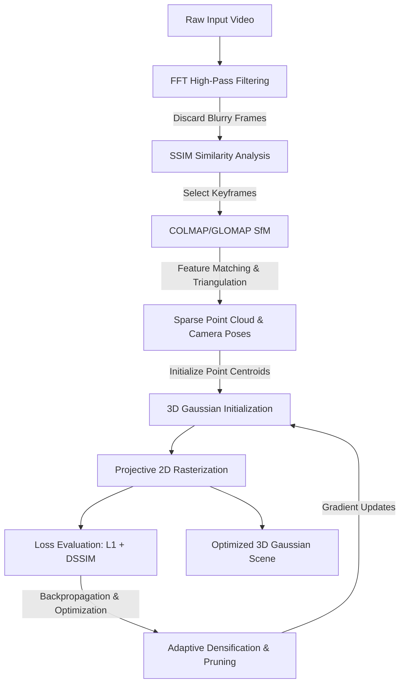
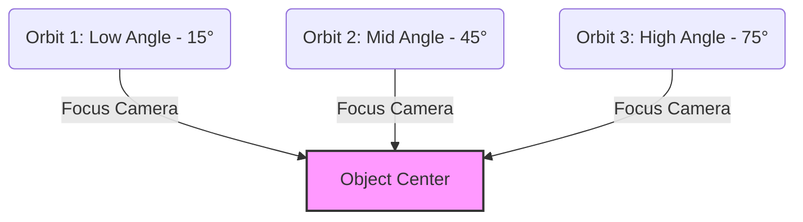
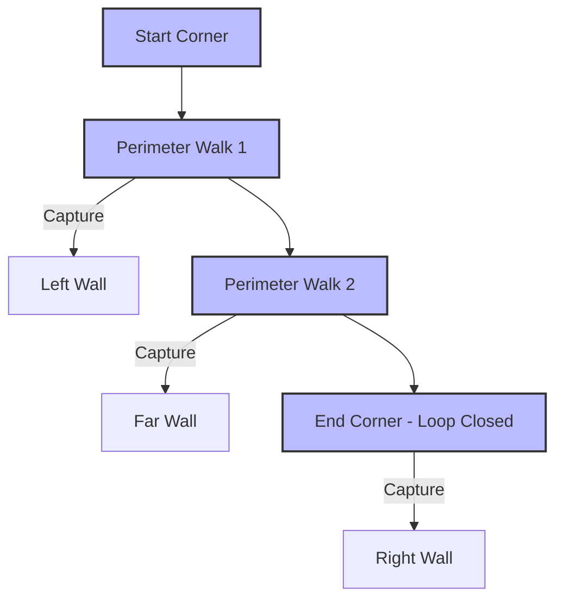

# High-Performance 3D Gaussian Splatting Pipeline

This repository hosts a standardized, high-performance pipeline for reconstructing physical scenes into **3D Gaussian Splats (3DGS)** from video inputs. The pipeline automates frame extraction, blur-filtering, Structure-from-Motion (SfM) camera registration, and neural rendering optimization.

---

## Directory Structure

The repository contains only the core pipeline scripts and configuration. The local environment, third-party libraries, and dataset folders are generated dynamically during setup to keep the repository size lightweight.

```
gaussian_splat/
  ├── colmap/                  # [Generated] Local CUDA-enabled COLMAP 4.0.2 binaries
  ├── gplat-env/               # [Generated] Portable Conda environment (Python 3.10 + CUDA 12.1)
  ├── gsplat_src/              # [Generated] Shallow-cloned gsplat v1.5.2 (patched for Windows compatibility)
  ├── scripts/                 # [Tracked] Core automation & execution scripts
  │     ├── patches/           # [Tracked] Local patch files
  │     │     └── simple_trainer.py
  │     ├── setup_env.ps1      # Environment setup script
  │     ├── update_colmap.ps1  # COLMAP binary deployment script
  │     ├── preprocess.py      # Video frame extraction & filtering pipeline
  │     └── reconstruct.ps1    # Unified reconstruction orchestrator
  └── projects/                # [Ignored] Scene dataset folders (contains empty .gitkeep)
        ├── <project_name>/
        │     ├── input/       # Raw video file (mp4, webm, mov, etc.)
        │     ├── images/      # Preprocessed 4K frames (lossless PNG)
        │     ├── images_2/    # Downsampled 1080p target images (lossless PNG)
        │     ├── database.db  # COLMAP feature database
        │     ├── sparse/0/    # SfM sparse camera binaries (cameras.bin, points3D.bin)
        │     └── splats/      # Output splats (PLY files, videos, checkpoints)
```

---

## 3D Gaussian Splatting: Core Theory

3D Gaussian Splatting (3DGS) represents a 3D scene using millions of volumetric, anisotropic 3D Gaussians. Unlike implicit neural representations (like NeRFs), which query a coordinate network along rays, 3DGS is an explicit representation that projects 3D volumes directly onto the 2D image plane. This allows for real-time rasterization exceeding 100 FPS.

### Scene Representation
Each 3D Gaussian is parameterized by:
1. **Position (Mean $\mu \in \mathbb{R}^3$)**: The centroid of the Gaussian in 3D space.
2. **Covariance ($\Sigma \in \mathbb{R}^{3\times 3}$)**: Defines the size and orientation of the volume. To keep $\Sigma$ positive semi-definite during optimization, it is factored into a scaling vector $s \in \mathbb{R}^3$ and a rotation quaternion $q \in \mathbb{R}^4$:
   $$\Sigma = R S S^T R^T$$
3. **Opacity ($\alpha \in [0, 1]$)**: The volumetric density parameter.
4. **Color**: Represented using Spherical Harmonics (SH) coefficients to capture view-dependent appearance (such as reflections and specular highlights).

### Optimization Workflow
The pipeline processes raw input video into an optimized 3D scene through a continuous feedback loop:



### Rasterization & Adaptive Control
- **Differentiable Rasterization**: The 3D Gaussians are projected onto the camera's image plane:
  $$\Sigma' = J W \Sigma W^T J^T$$
  where $W$ is the viewing transformation and $J$ is the Jacobian of the projective transformation. The projected Gaussians are sorted by depth and alpha-blended along each pixel.
- **Adaptive Density Control**: Periodically, the algorithm prunes Gaussians with low opacity ($\alpha < 0.05$) and densifies (splits or duplicates) Gaussians in areas with high positional gradients.

---

## Capture & Recording Guidelines

For the Structure-from-Motion (SfM) camera registration to succeed, the input video must be captured using specific strategies.

### Fundamental Capture Rules
- **Maximize Parallax (Translation)**: Always translate the camera through space (walk around the subject). Do *not* rotate the camera from a single fixed position (panning), as this creates zero parallax and camera registration will fail.
- **Ensure High Overlap**: Maintain a $70\% - 80\%$ visual overlap between consecutive frames. Every part of the scene should be captured from at least three different vantage points.
- **Perform Loop Closure**: End your scanning path exactly where you began. This forms a closed loop, allowing the optimizer to distribute and eliminate drift errors.

### Device-Specific Recording Strategies

| Device Class | Recommended Settings | Motion & Capture Pattern |
| :--- | :--- | :--- |
| **Smartphones** | 4K resolution at 60 FPS. Enable **AE/AF Lock** (exposure/focus lock) to prevent camera adjustments. Use the primary wide lens (avoid ultra-wide). | Move slowly and steadily. Follow a hemispherical orbit pattern around the subject at three different heights. |
| **DSLR & Mirrorless** | Manual mode. Keep shutter speed fast ($\ge 1/120\text{s}$) to prevent motion blur. Lock aperture to $f/5.6 - f/8$ for a deep depth of field. Lock manual focus. | Keep zoom locked (do not zoom in/out during scanning). Walk slow paths, ensuring clean coverage of both details and wide context. |
| **Drones (UAVs)** | Lock exposure and set white balance to a fixed preset. Fly on overcast days (diffuse lighting) to avoid moving shadows. | Combine a nadir (top-down) grid pass, an oblique pass (45-degree camera tilt), and circular orbits around structures. |

### Visual Scan Patterns

#### Hemispherical Orbit (Object Scan)
For isolated objects, capture three overlapping circular passes at different altitudes.



#### Perimeter Walk (Scene Scan)
For rooms or outdoor courtyards, walk the perimeter in a closed loop while facing slightly outward.



---

## Setup & Installation

### Prerequisites
- **Operating System**: Windows 10 or 11 (PowerShell is required).
- **Hardware**: An NVIDIA GPU with CUDA support (strongly recommended to have at least 8GB of VRAM).
- **Git**: Git must be installed and available on your system `PATH` to fetch dependencies.

### Installation Steps

1. Clone this repository to your local machine.
2. Open PowerShell and allow script execution for this session (if your system policy restricts running scripts):
   ```powershell
   Set-ExecutionPolicy -ExecutionPolicy RemoteSigned -Scope Process
   ```
3. Run the setup script from the root folder:
   ```powershell
   .\scripts\setup_env.ps1
   ```

### What the Setup Script Automates:
*   **Miniconda Installation**: Installs Miniconda locally under your user profile if it's not already detected.
*   **Local Conda Environment (`gsplat-env`)**: Sets up a local Python 3.10 environment, installs PyTorch 2.4.1 (CUDA 12.1), and downloads standard pipeline packages.
*   **Precompiled `gsplat` Wheels**: Installs the precompiled binary wheels of `gsplat 1.5.2` directly, eliminating the need to have a host Microsoft Visual Studio C++ Compiler.
*   **Automated Windows Patching**: Shallow-clones the official `nerfstudio-project/gsplat` repository at version `v1.5.2` and applies a custom Windows compatibility patch to the training script (replacing `fused_ssim` with `torchmetrics` to prevent import/compilation failures on Windows).
*   **COLMAP binaries**: Downloads and configures local CUDA-enabled COLMAP 4.0.2 with GLOMAP integration into your root directory.

---

## How to Use

### 1. Initialize a New Scene
1. Create a new directory inside `projects/` named after your scene (e.g., `projects/living_room/`).
2. Inside that directory, create an `input/` folder.
3. Place your raw input video (e.g., `living_room.mp4`) inside `projects/<project_name>/input/`.

### 2. Run the Unified Reconstruction
Run the unified `reconstruct.ps1` script. It automatically detects the video, extracts frames, performs COLMAP registration, and trains the Gaussian Splat model:

```powershell
# Reconstruct the scene with 1080p target training (DataFactor 2) and MCMC optimization:
.\scripts\reconstruct.ps1 -ProjectName "living_room" -DataFactor 2 -MaxSteps 20000

# Reconstruct the scene at full 4K resolution (DataFactor 1) for 10,000 steps:
.\scripts\reconstruct.ps1 -ProjectName "living_room" -DataFactor 1 -MaxSteps 10000
```

### Parameters:
*   `-ProjectName`: The folder name under `projects/` (defaults to `"computer_table"`).
*   `-DataFactor`: The downscaling ratio for training target images. `2` trains at 1080p (4x faster); `1` trains at original 4K resolution.
*   `-MaxSteps`: Total training iterations (defaults to `20000`).
*   `-Strategy`: Splat optimization strategy, e.g. `"mcmc"` (SOTA) or `"default"`.

---

## Core Scripts Reference

### 1. `setup_env.ps1`
Automates Miniconda installation, creates the local environment (`gsplat-env`), pulls PyTorch 2.4.1 (CUDA 12.1), pins compatible packages (`numpy 1.26.4`), builds the `pycolmap` dev branch, applies a Windows 64-bit binary layout alignment patch, and installs COLMAP 4.0.2 with GLOMAP.

### 2. `update_colmap.ps1`
Utility script to quickly download and extract the latest CUDA-enabled COLMAP release into the root directory.

### 3. `preprocess.py`
Processes the video in RAM to select sharp, distinct keyframes:
- **FFT High-Pass Filtering:** Discards blurry frames in real-time.
- **SSIM Comparison:** Ensures keyframes represent actual scene changes, preventing redundant/static frames.
- **Lossless Export:** Exports frames as `.png` to avoid compression artifacts that degrade neural rendering fidelity.

### 4. `reconstruct.ps1`
The primary orchestrator that coordinates the pipeline:
1.  Calls `preprocess.py` to populate images.
2.  Runs COLMAP feature extraction at dynamic resolutions (maximizes SIFT speed while registering camera matrices to full 4K coordinates).
3.  Executes sequential matcher with loop detection ($O(N)$ matching complexity suitable for video sequences).
4.  Runs GLOMAP (Global Mapping) for camera poses, falling back to incremental mapping if needed.
5.  Triggers the `gsplat` trainer with anti-aliasing, pose optimization, and appearance optimization enabled.

---

## Viewing the Splats
During training, the script spawns a real-time web viewer. You can navigate and inspect your training splat live at:
*   **http://localhost:8080**

The final output point clouds and rendered trajectories are saved to `projects/<project_name>/splats/`.

---

## Contributing

Contributions are welcome! Please see [CONTRIBUTING.md](CONTRIBUTING.md) for guidelines on how to submit bug reports, feature requests, or pull requests.

---

## License & Dependencies Licensing

This project is licensed under the [MIT License](LICENSE).

### Third-Party Software Licenses
This pipeline integrates and automates several open-source libraries and binaries, which are subject to their own respective licensing terms:
- **[gsplat](https://github.com/nerfstudio-project/gsplat)**: Licensed under the [Apache License 2.0](https://github.com/nerfstudio-project/gsplat/blob/main/LICENSE) (developed by nerfstudio-project authors).
- **[COLMAP](https://github.com/colmap/colmap)**: Licensed under the [BSD 3-Clause License](https://github.com/colmap/colmap/blob/main/COPYING.txt) (Copyright (c) Johannes L. Schönberger).
- **[GLOMAP](https://github.com/colmap/glomap)**: Licensed under the [BSD 3-Clause License](https://github.com/colmap/glomap/blob/main/LICENSE) (Copyright (c) 2024, ETH Zurich).
- **[PyColmap](https://github.com/colmap/pycolmap)**: Licensed under the [BSD 3-Clause License](https://github.com/colmap/pycolmap/blob/main/LICENSE).
